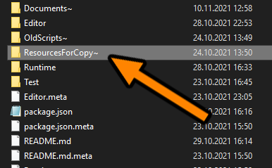
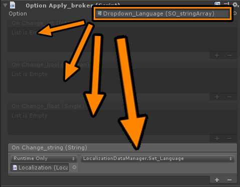
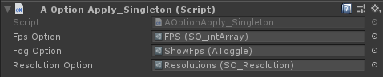
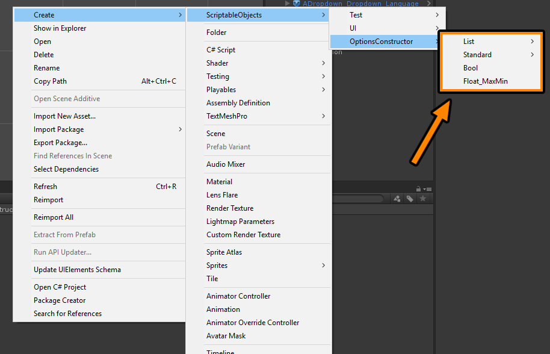

# Options Constructor

<!-- TABLE OF CONTENTS -->

  
Table of Contents

  <ol>
    <li><a href="#How-to-add-to-project">How to add to project</a></li>
    <li><a href="#How-to-create-and-configure-files">How to create and configure files</a></li>
    <li><a href="#How-package-work">How package work</a></li> 
  </ol>

## How to add to project
* Copy hiden folder from package to `asset/$your_folder$`  

* Configure exist prefabs for your project and add to scene.
* For apply options use `Option_ApplyBroker.cs` with unity events, which automaticly enable when you select option scriptableObject:  

* For apply deffault system options (FPS, Resolution, Fog...) use `OptionApply_Singleton.cs`  

## How to create and configure files
* Create option scriptableObject files  

* Configure and drop to:
    - `UI_Option$type$.cs` for user can change! 
    - `Option_ApplyBroker` for apply! 
    - if it's deffault system option (FPS, Resolution, Fog...) drop to `OptionApply_Singleton.cs`

## How package work
* All `OptionApply_broker.cs` subscribe to self scriptableObject options to OnChange. Immediately after subscribe, `OptionApply_broker.cs` read value fom option and invoke events.
* `OptionApply_Singleton.cs` subscribe to options to OnChange. Immediately after subscribe, apply option value to deffault system settings (FPS, Resolution, Fog...).
* When user change setting in `UI_Option$type$.cs` changes invoke OnChange, and then invoke all subscribers for change. Subscribers read value from scriptableObject and apply or invoke events.
* All option data saves to `PlayerPrefs` as string.
